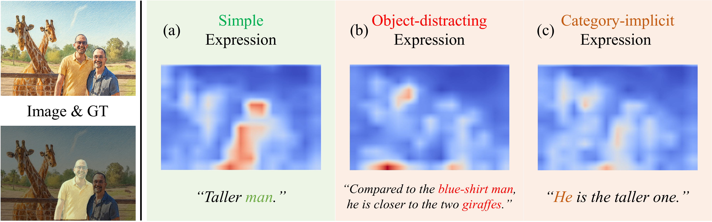
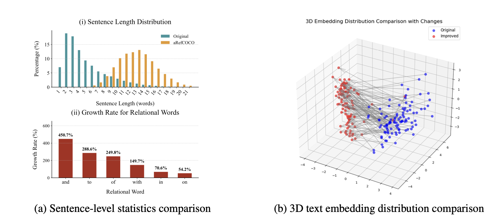

# aRefCOCO Dataset - SaFiRe: Saccade-Fixation Reiteration with Mamba for Referring Image Segmentation [NeurIPS 2025]
[](https://zhenjiemao.github.io/SaFiRe/)
[](https://arxiv.org/pdf/2510.10160)
[](https://arxiv.org/abs/2510.10160)
[](https://github.com/zhenjiemao/SaFiRe)
[](https://github.com/zhenjiemao/aRefCOCO)
[](https://huggingface.co/datasets/zhenjiemao/aRefCOCO)
[](https://creativecommons.org/licenses/by/4.0/)

Welcome to the official repository for the **aRefCOCO dataset** presented in "SaFiRe: Saccade-Fixation Reiteration with Mamba for Referring Image Segmentation."

## 👀 About Referential Ambiguity

<div align="center">
  
</div>

Current RIS methods primarily focus on simple expression pattern, However, in real-world applications, referring expressions often exhibit **referential ambiguity**.

We summarize referential ambiguity into two challenging cases:

- **object-distracting** expression, e.g., “compared to the blue-shirt man, he is closer to the two giraffes”.
- **category-implicit** expression,, e.g., “he is the taller one”.

## 🔍 Dataset

In our paper, we present **aRefCOCO** (ambiguous RefCOCO), a test-only benchmark with challenging **object-distracting** and **category-implicit** referring expressions, targeting real-world **referential ambiguity**.

<div align="center">
  
</div>

Below are more detailed statistics about the aRefCOCO benchmark:

<div align="center">

|  Split  | Objects | Sentences | Images | Avg. Words | Avg. Distractors |
| :--------: | :-------: | :---------: | :------: | :----------: | :----------------: |
| **Test** |  4,112  |   7,050   | 2,213 |    12.6    |       3.1       |

</div>

<sub>“Avg. Words” denotes the average number of words per sentence; “Avg. Distractors” refers to the average number of same-category distractors per image.</sub>

<br>

**[🎉 UPDATE]** To facilitate further research, we **extend** the aRefCOCO benchmark with a train split.

In summary, the **extended aRefCOCO dataset** now includes:

<div align="center">

| Split | Objects | Sentences | Images | Description |
|:------:|:---------:|:-----------:|:----------:|:-------------|
| **Train** | 41,417 | 110,818 | 18,496 | Newly added; for model training and exploration. |
| **Test** | 4,112 | 7,050 | 2,213 | Original aRefCOCO split used in the paper. |

</div>

## 📐 Pytorch Usage

### Data Preparation

1. Download [RefCOCO](http://bvisionweb1.cs.unc.edu/licheng/referit/data/refcoco.zip) and [RefCOCOg](http://bvisionweb1.cs.unc.edu/licheng/referit/data/refcocog.zip) along with the [arefcoco.json](https://github.com/zhenjiemao/aRefCOCO/blob/master/arefcoco.json) in our repo.

> If the above RefCOCO and RefCOCOg links are unavailable, you can also find the datasets here: [RefCOCO](https://drive.google.com/file/d/1mwVICSlwzPd2OMhzPRTJI6lhQh-JWiy_/view?usp=sharing)/[+](https://drive.google.com/file/d/1-_nge_JXmdcFcG76PEFM-pksWPunD5SB/view?usp=sharing)/[g](https://drive.google.com/file/d/194Dnf_3KjpYKuucXluwn5XJIO--0QrMZ/view?usp=sharing).

2. Download images from [COCO](https://cocodataset.org/#download). Please use the first downloading link 2014 Train images [83K/13GB].

After downloading the dataset, the directory should look like this:

```
├── ref_dataset/data
│   │
│   ├── train2014
│   │   ├── COCO_train2014_000000193977.jpg
│   │   ├── COCO_train2014_000000387678.jpg
│   │   └── ...
│   │ 
│   ├──arefcoco
│   │   └── arefcoco.json   
│   │ 
│   ├── refcoco
│   │   ├── instances.json
│   │   ├── refs(google).p
│   │   └── refs(unc).p
│   │
│   ├── refcocog
│       └── ...
```

### Dataloader
We provide an easy-to-use dataloader implemented in the [refdataset](https://github.com/zhenjiemao/aRefCOCO/tree/master/refdataset) directory, as shown below:
```python
import argparse
from refdataset import build_dataloader  

# Configure parameters
args = argparse.Namespace()
args.data_path = './refdataset/data'  # Dataset path
args.data_set = 'arefcoco'            # Dataset type
args.test_split = 'test'               # Test split
args.input_size = 512                  # Input image size
args.batch_size = 16                   # Batch size
args.num_workers = 4                    # Number of data loading workers
args.pin_mem = True                     # Whether to use pin_memory

# Build dataloaders
train_loader, val_loader = build_dataloader(args)

# Use dataloader
for batch in train_loader:
    query_img = batch['query_img']      # Image tensor
    query_mask = batch['query_mask']    # Segmentation mask
    sentence = batch['sentence']       # Description text
```

Note that this dataloader can also be directly used for the original RefCOCO series by setting `args.data_set` to `refcoco`, `refcoco+` or `refcocog`.

## 🤗 Hugging Face Usage
The dataset can also be conveniently loaded and explored using the [Hugging Face Datasets library](https://huggingface.co/docs/datasets), as illustrated below:
```python
from datasets import load_from_disk

# Load the dataset
train_ds = load_from_disk("/path/to/hf_datasets/train")

# Retrieve sample data
sample = train_ds[0]

# Access the three core elements
image = sample['image']
mask = sample['mask']
descriptions = sample['descriptions']

# Print sample information
print(f"Entity ID: {sample['entity_id']}")
print(f"Category: {sample['category_name']}")
print(f"BBox: {sample['bbox']}")
print(f"Descriptions: {sample['descriptions']}")
```

🤗 **[Explore the dataset on Hugging Face](https://huggingface.co/datasets/zhenjiemao/aRefCOCO)**

## Acknowledgements
We sincerely appreciate the contributions of the open-source community for their work on data processing and usage. The related projects are as follows: [ReMamber](https://github.com/yyh-rain-song/ReMamber), [LAVT](https://github.com/yz93/LAVT-RIS).

## Citations

If you find our work helpful for your research, please consider citing our work.

```bibtex
@article{mao2025safire,
  title={SaFiRe: Saccade-Fixation Reiteration with Mamba for Referring Image Segmentation}, 
  author={Zhenjie Mao and Yuhuan Yang and Chaofan Ma and Dongsheng Jiang and Jiangchao Yao and Ya Zhang and Yanfeng Wang},
  journal={Advances in Neural Information Processing Systems (NeurIPS)},
  year={2025}
}
```

We also recommend other highly related works:

```bibtex
@article{yang2024remamber,
  title   = {ReMamber: Referring Image Segmentation with Mamba Twister},
  author  = {Yuhuan Yang and Chaofan Ma and Jiangchao Yao and Zhun Zhong and Ya Zhang and Yanfeng Wang},
  journal = {European Conference on Computer Vision (ECCV)}
  year    = {2024},
}
```